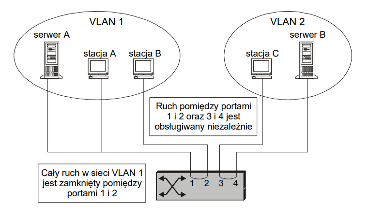
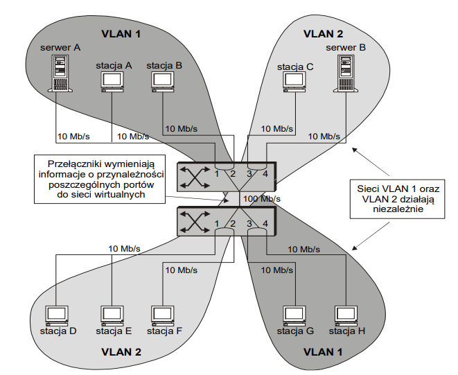
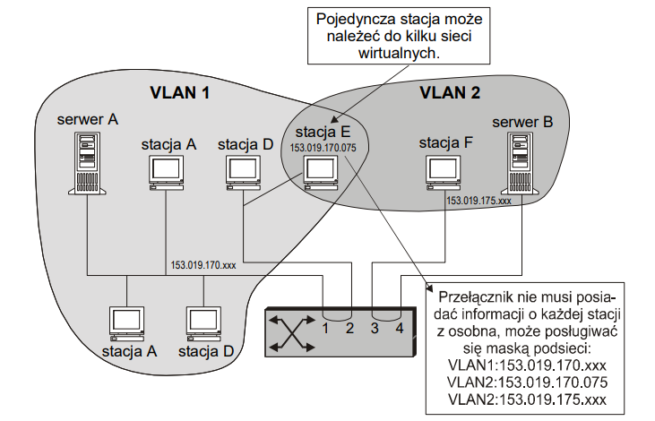
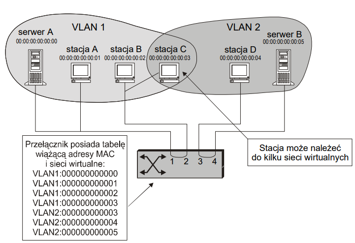

# VLAN - LOKALNE SIECI VIRTUALNE

## Potrzeba VLAN

Gdy w firmie zmiany organizacyjne odbywają się cały czas, oparcie tworzenia logicznych sieci na bazie przepinania kabli od użytkowników do odpowiednich przełączników staje się uciążliwe, a czasami nawet niemożliwe (użytkownik jest za daleko od danego urządzenia sieciowego lub np. w innym budynku).

Żądanie większej elastyczności konfiguracji sieci spowodowało powstanie koncepcji wirtualnych sieci LAN (VLAN), będących sposobem całowicie programowych zmian "okablowania".

VLAN - to sieć umożliwiająca logiczne (wirtualne) grupowanie stanowisk pracy, czyli stacji roboczych, niezależnie od tego, gdzie są one fizycznie zainstalowane w sieci.

VLAN - umożliwia grupowanie wszystkich serwerów w jednym miejscu, co ułatwia ich zarządzanie i eksploatację, pomimo że świadczą usługi wielu odrębnym grupom roboczym.

### Definicje przypomnienia

- **Domena rozgłoszeniowa** (ang. Broadcast domain) - to grupa stacji, do których docierają ramki rozgłoszeniowe, czyli adresowane "do wszystkich". Podział domeny kolizyjnej na mniejsze części nie rozdziela domeny rozgłoszeniowej, gdyż ramki rozgłoszeniowe powielane są przez przełączniki na wszystkich portach.
- **Sztorm rozgłoszeniowy** - jest konsekwencją powielania ramek rozgłoszeniowych przez przełączniki na wszystkich portach, powstaje, jeżeli w sieci jest wiele stacji, które wysyłają dużo ramek rozgłoszeniowych.
- **Domena kolizyjna** (ang. Collision domain) - to grupa stacji roboczych połączonych ze sobą wspólnym medium transmisyjnym. Każda stacja należąca do grupy (domeny kolizyjnej) ma bezpośredni wpływ na jakość (możliwość) transmisji innych stacji. Domeną kolizyjną jest więc np. grupa stacji podłączonych do segmentu sieci Ethernet.
- **Sztorm kolizyjny** - zjawisko to może wystąpić w dużych domenach, przy znacznym obciążeniu sieci polegające na powstaniu zwiększonej liczby kolizji uniemożliwiających efektywną transmisję danych.
- **Segmentacja sieci** - w sieciach z dostępem niedeterministycznym, nadmierny wzrost żądań obsługi transmisji danych powoduje zjawisko kolizji, które utrudnia lub nawet uniemożliwia prawidłową pracę sieci. Konieczny staje się wówczas podział domeny kolizyjnej na mniejsze części (segmenty). Segmencie, co zmniejsza obciążenie sieci.

### Problem separacji topologii logicznej od topologii fizycznej

1. Rozwiązanie antyczne - wszystkie komputery podłączone do jednegi kabla (koncetrycznego) - decyduje geografia 100%
2. Lata 90. - koncetratory i skrętka (10Base-T) (**później mosty/przełączniki**) umożliwienie konfiguracji sieci logicznie a nie geograficznie (w ogranicznonym zakresie)

### **Czy** ma znacznie, kto jest w której sieci LAN? W końcu w praktycznie każdej organizacji wszystkie LAN są ze sobą połączone

**TAK** - ma znaczenie, bo:

1. Bezpieczeństwo - ustawianie kart w tryb nasłuchu...
2. Obciążenie sieci - warto odseparować sieci bardzo obciążone od reszty
3. Rozgłoszenia - wiele sieci lokalnych obsługuje rozgłoszenia i wiele protokołów warst wyższych korzysta z tej funkcji (np. ARP) - zagrożeniem są również sztormy rozgłoszeniowe (broadcast storm)

**Cel** tworzenia w LAN lokalnych sieci wirtualnych - podział domeny rozgłoszeniowej bez Routerów!!!

### Opóźnienie

1. Routery "ze średniej półki" - około 200 mikrosek.
2. Przełączniki "ze średniej półki" - około < 10 mirkosek.

### Idea: sieć VLAN = domena rozgłoszeniowa

VLANy zmieniają istotnie rolę routerów, które służa już tylko do połączeń pomiędzy sieciami lokalnymi

Z wielu różnie funkcjonujących modeli sieci wirtualnych najeiksze zainteresowanie wzbudzają:

1. **Segmentacja wirtualna** - polegająca na logicznym wydzieleniu z sieci fizycznej określonej grupy, lub nie nakładających się grup użytkowników (stacji końcowych, serwerów, terminali), zwanych segmentem wirtualnym (virtual segment). Każdy segment funkcjonuje w tym przypadku jako autonomiczna domena sieci, identyfikowana jednym adresem sieciowym (np. w protokole IP). Jest to najprostszy sposób tworzenia grup roboczych wewnątrz sieci LAN lub połączonych ze sobą, ale fizycznie odrębnych sieci lokalnych. Segmenty wirtualne są protokolarne przezroczyste (nieczułe), a zakres działania tych protokołów jest wyznaczony przez obszar segmentu wirtualnego. Przekaz informacji pomiędzy różnymi segmentami wymaga obecności wieloprotokołowych routerów spełniających funkcje zapory ogniowej (ang. firewall).
2. **Podsieć wirtualna** - w której realizowany jest bardziej elastyczny i wyrafinowany podział użytkwoników, niż zwykła segmentacja wirtualna. Oprócz tworzenia segmentów wirtualnych umożliwa ona instalację firewalli, oddzielnie dla każdego protokołu działającego w sieci (IP, IPX, ...), co zapewnia kontrolowany przekaz pomiędzy segmentami wirtualnymi, bez dodatkowego routera trasującego. Ruch pakietów między segmentami sieci jest poddawany znacznie szerszej kontroli, modelowanej programowo przez routery trasowania wirtualnego. W podsieci wirtualnej obszar działania poszczególnych protokołów sieciowych może być (i zwykle jest) różny dla konkretnych aplikacji sieciowych. Taka konstrukcja pozwala na przyporządkowanie konkretmej stacji równocześnie do wielu odrębnych grup roboczych.

## Sposoby okroślania przynależności do sieci wirtualnej

### Przynależność stacji do sieci VLAN można definiować poprzez

#### Grupowanie portów (segment wirtualny)

W tej metodzie nie można przyporządkować jednej stacji do dwóch VLAN

#### Grupowanie adresów warstwy sieciowej (podsieć wirtualna)

Narusza zasadę - niezależność warstw

#### Grupowanie adresów MAC

#### Tworzenie grup multicastowych adresów IP (IP Multicast Groups)

polega na dynamicznym rejestrowaniu specjalnych adresów IP, które definują sieć VLAN. Każda stacja ma możliwość podłączenia się do takie grupy multicastowej odpowiadając na powiadomienie o jej istnieniu, może też stworzyć własną grupę. Jeżeli wysyłany jest pakiet IP pod adres określający taką grupę to dociera on do wszystkich stacji do niej należących

Zalety:

- Zachowana ogólna idea sieci VLAN jako domeny rozgłoszeniowej (stacje, które zostaną dołączone do takiej grupy mogą być traktowani jako członkowie sieci wirtualnej)
- Utworzona domena wirtualna istnieje tylko przez określony czas, a dynamicznie definiowane w ten sposób sieci VLAN mogą być bardzo elastyczne, dostosoując się do żądań użytkowników.
- Pozwala ono na włączenie w sieć wirtualną routerów i przez to sieci WAN

Oczywiście routery wchodzące w skład takiej sieci muszą umieć routować pakiety z adresami typu multicast (zatem wymagane jest zaimplementowane w routerach specjalnego protokołu routingu).

#### Użycie reguł logicznych

najelastyczniejszy model tworzenia sieci wirtualnej (reguły logiczne sprowadzające się do zdefiniowania przez użytkownika określonych pól ramki)

Model reguły logicznej jest kombinacją modeli podsieci wirtualnej, grupowania adresów MAC z listą adsresów IP dla hostów.

Model reguły logicznej jest bardzo elastyczny, ale również dość skomplikowany.

## Przesyłanie informacji o przynależności do sieci wirtualnej pomiędzy przełącznikami

Przełączniki sieciowe komunikują się wzajemnie, aby przekazać informacje o przynależności poszczególnych stacji do sieci VLAN.

Zagadnienia te stanowią przedmiot m.in. standardów IEEE 802.1p/Q.

W sieciach zdefiniowanych w oparciu o grupowanie portów albo adresów MAC przełączniki muszą przesyłać informację o każdej stacji z osobna.

W sieciach opartych o grupowanie adresów warsty sieciowej informacja taka może dotyczyć grupy stacji należących do tej samej podsieci.

Producenci opracowali szereg własnych konwencji zwykle całkowicie niezgodnych. W ogólności wyróżnić można trz typy komunikacji pomiędzy przełącznikami VLAN:

- ### Przesyłanie tabel

    gdy stacja końcowa wyśle po raz pierwszy ramkę, przełącznik na podstawie swojej statycznej tablicy i adresu MAC stacji zawartego w wysłanej ramce określa jej przynależność do sieci VLAN w każdym z przełączników jest przeprowadzane ręcznie. W związku z tym metoda ta nie nadaje się do dużych sieci. Co więcej, wraz ze wzrostem rozmiarów sieci rośnie ruch pakietów informacyjnych na łączach pomiędzy przełącznikami.

- ### Oznaczanie ramek

    polega ono na **wydzieleniu** specjalnych **kanałów - szczelin czasowych** na łączach pomiędzy przełącznikami. Poszczególne kanały należą do różnych sieci wirtualnych. Metoda ta oszczędza co prawda na przesyłaniu dodatkowych informacji przez sieć, ale nie pozwala na wykorzystanie całego pasma kanału - część pasma kanału przeznaczona dla jednej sieci VLAN nie może być bowiem używana przez inną, nawet jeżeli nic nie jest w danych podkanale transmitowane.
