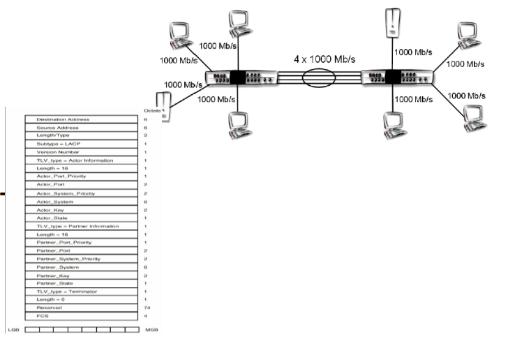
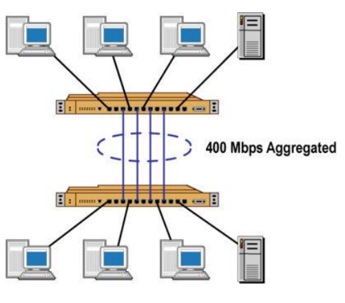
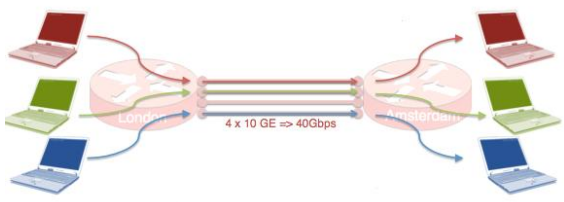
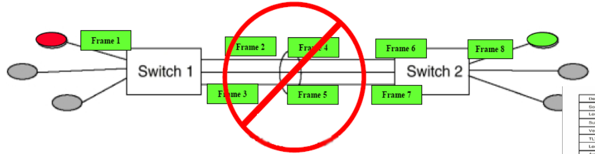
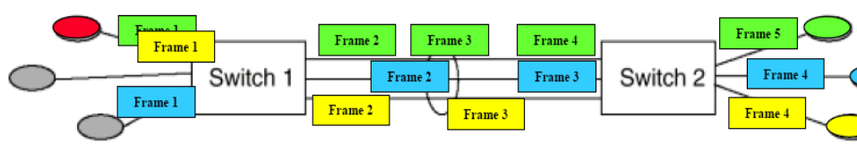

# Agregacja łączy

- "pełen dupleks" - po 100(0) Mb/s w każdym kierunku
- opcja automatycznego przełączania ruchu ma łącze zapasowe w momencie awarii łącza podstawowego
- mechanizm "load balancing" - równomiernego rozkładania obciążenia na poszczególne łącza

## Właściowości

- Zwiększona przepustowość

    

- Zwiększona niezawodność

    ![zdjęcie]
    (zwiekszona_niezawodnosc.png)

- Podział obciążenia ruchu

    

## Jak?

- Co z kolejnością?

    
    

- Zapobiega zmianom kolejności nadawania ramek (miss-ordering)
- Zapobiega duplikacji ramek

## Właściwości

- automatyczna rekonfiguracja
- szybka rekonfiguracja - 1 sekunda
- wsparcie dla klientów MAC standardu 802.3
- kompatybilność z urządzeniami nie wspierającymi agregacji
- wsparcie dla zarządzania siecią
- możliwość połączenia rónych typów fizycznych łączy

## Ograniczenia

- tryb full-duplex
- identyczna przepływność na łączach
- połączenia Point to Point
- połączenie **tylko** mięzy jednostkami MAC wspierającymi standard IEEE 802.3
