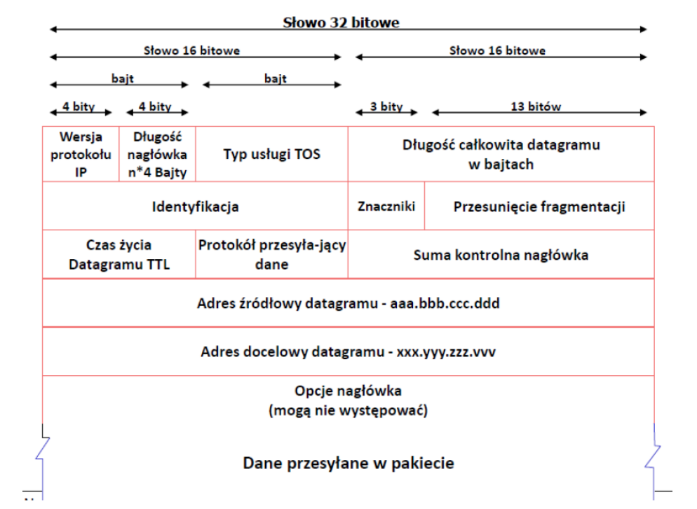
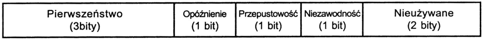
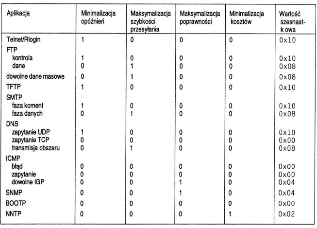
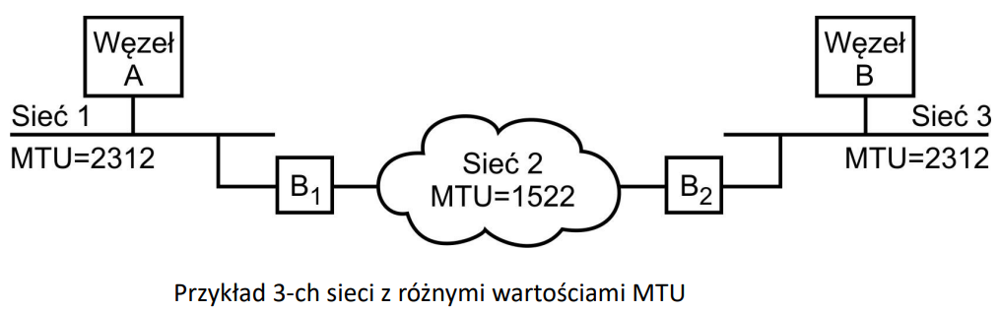

# Datagram IP

## Budowa datagramu IP

### Wersja protokołu IP

- Obecna wersja - 4
- Docelowo - IPv6 z m.in. 128 bitowym adresem oraz mechanizmami QoS

### Typ usługi TOS

- 3 bitowy wskaźnik priorytetu danych (0 - 7)
- Flagi optymalizacji trasy:
  - "minimalne opóźnienia"
  - "maksymalna przepustowość"
  - "najlepsza poprawność"
  - "najniższy koszt połączenia"

Typ usługi

RFC 2474 - Definition of the Differentiated Services Field in the IPv4 and IPv6 Header

### Identyfikacja

Numer "seryjny" utworzonego przez nadawcę datagramu. Wraz jego adresem IP jednoznacznie identyfikuje każdy datagram w całym Internecie

### Znaczniki

Są trzy opcje:

- 0
- DF - Don't fragment - zakaz fragmentacji
- MF - More fragment:
  - 1 - więcej fragmentów
  - 0 - ostatni fragment

Przesunięcie fragmentacji = przesunięcie tego fragmentu datagramu w stosunku do początku oryginalnego datagramu

Wpływ fragmetacji datagramu:

- zmniejsza prawdopodobieństwo jego bezbłędnego dotarcia do celu
- zwiększa rozmiar przesyłanych informacji
- podnosi koszt operacji routowania

Protokół wyższego rzędu powinien unikać fragmentacji datagramu.

### Czas życia Daragramu TTL

- Zmniejszany po każdym przejściu przez węzeł
- Zabezpiecza przed zapętleniem datagramu w sieci
- Użyteczny przy próbach śledzenia tracy (tracert)

### Suma kontrolna nagłowka

- Zabezpiecza przed pojedynczymi i seryjnymi błędami w nagłówku
- Prosty algorytm (suma modulo 2)

### Adresy

- Jednoznacznie identyfikują hosta w sieci
- Na podstawie adresu docelowego węzły pośredniczące dokonują wyboru drogi przesyłania datagramu przez sieć (next hop)

### Opcje nagłówka

- Rejestracja trasy i czasu przejścia przez węzły sieci
- Wymuszenie drogi routingu (swobodne lub dokładne)
- Ograniczenia dot. bezpieczeństwa

## Podział datagramu na fragmenty i ponowne składanie

Różne sieci skłądowe Internetu mają odmienne dopuszczalne formaty i długości jednostek danych protokołu sieciowego i datagram IP może być za długi. Zachodzi konieczność jego podziału na fragmenty, aby nie przekroczyć wielkości MTU (Maximum Transfer Unit).

- Datagram wysyłane z węzła A należy w bramie B1 dzielić na fragmenty o długości nie przekraczającej 1522 oktetów (np. 1156 oktetów).
- Każdy z fragmentów ma identyczny identyfikator ID (taki jak cały datagram). Fragmenty z wyjątkie ostatniego mają bit MF=1 (3-ci bit w polu FLAGS). W polu OFFSET każdy fragment ma wielkość przesunięcia względem początku pola danych Datagramu*
