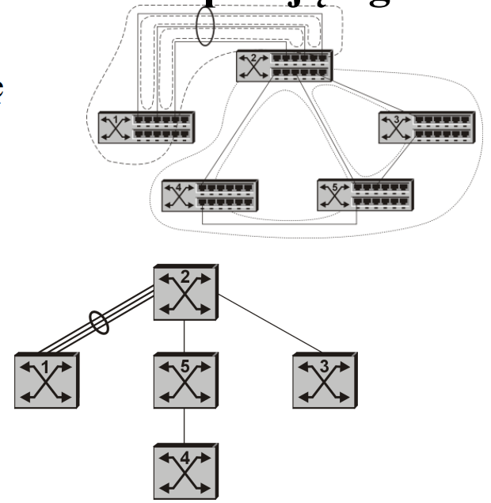

# Mechanizm drzewa opinajacego

Recepta **pętlenie** się ramek

- dla całych sieci
  - **IEEE 802.1d**
  - **IEEE 802.3w** (2001r.)
- dla sieci VLAN **IEEE 802.1Q/802.1s** (2001r.) Common/Multiple Spanning Tree

**Struktura przykładowej sieci po implementacji (R/M)STP i LA**

## Nowe algorytmy drzewa opinającego

### Cel - skrócenie czasu rekonfiguracji

- **IEEE 802.3w - Rapid Spanning Tree** - suplement określający standardową metodę szybkiej rekonfiguracji drzewa opinającego. Zawiera w stosunku do STP:
  - nowy, szybszy sposób rozyłania (rozszerzonych) ramek BPDU
  - nowe stany
  - nowe role portów
- **Multiple Spanning Tree 802.1s** - suplement do 802.1Q pozwalający na tworzenie drzewa oddzielnie dla każdego VLANa.
- **Cisco PVST, PVST+** - własne rozszerzenie CISCO, zoptymalizowane pod kątem użycia w siechach VLAN (drzewo opinające jest tworzone oddzielnie dla każdej VLAN, co powoduje, że łączne zblokowane dla jednej z sieci wirtualnych, jest używane przez inne. Wadą tej metody jest wzrost przesyłanych informacji BPDU(proporcjonalny do ilości sieci VLAN)) i spowolnienie całego procesu tworzenia drzew.
