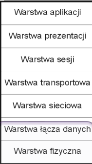
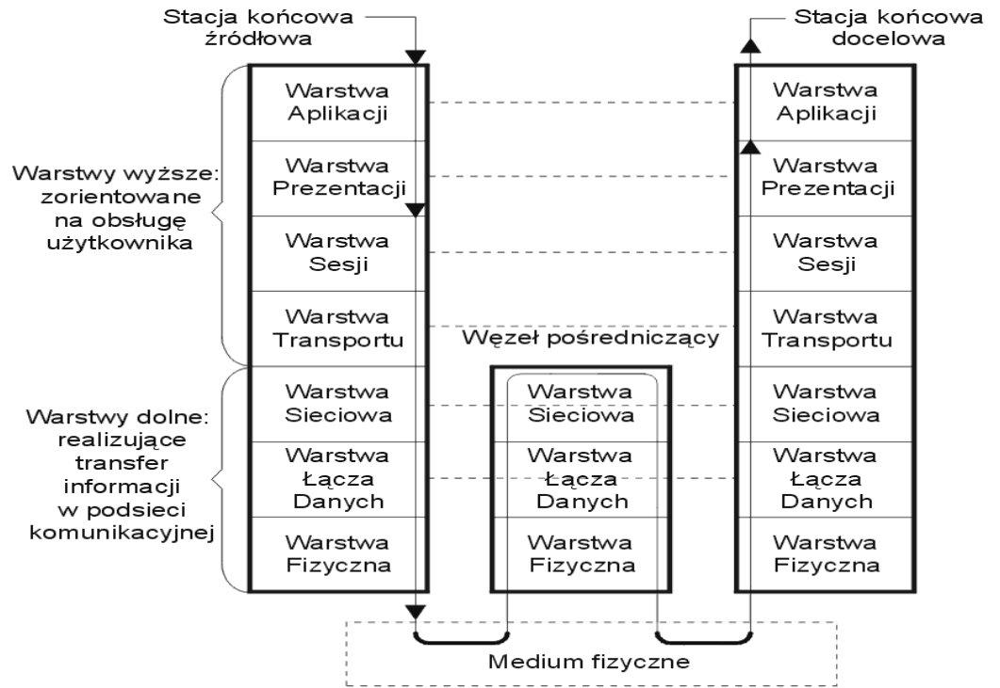

# ISO OSI

## Warstwy

### Warstwa fizyczna

- Definiuje zasady, zgodnie z którymi bity przepływają między komunikującymi się stacjami (uwzględnia potrzeby synchronizacji)
- Dostosowanie postaci sygnałów do właściwości medium
- Styk ten opisuką cztery charakterystyki:
  - mechaniczna
  - elektryczna
  - funkcjonalna
  - proceduralna
- Przykładem rozwiązania warstwy fizycznej jest styk RS232C

### Warstwa łaczy danych

- Tworzenie ramek
- Zapewnienia niezawodny przekaz ramek kanałem cyfrowym wnoszącym zakłócenia
- Sterowanie przepływem ramek
- Sterowanie dostępem do medium komunikacyjnego
- Przykładami protokołów tej warstwy są podstawowe standardy IEEE 802 (jest także HDLC)

### Warstwa sieciowa

- Dokonuje wyboru trasy między stacją źródłową a docelową
- Odpowiada też za ochronę sieci przed przeciążeniami
- Zapewnia "przezroczysty" przekaz informacji między sieciami (brak ingerencji w przesyłane dane)
- Dokonuje segmentacji i resegmentacji przesyłanych pakietów

### Warstwa transportowa

- Gwarantuje niezawodny i "przezroczysty" przekaz danych między stacjami końcowymi (sterowanie end-to-end)
- Wykruwa jak i retransmituje wszystkię błędnie przesyłane lub utracone bloki danych
- Steruje przepływem, wykorzystuje mechanizm okna

### Warstwa sesji

- Odpowiada za nawiązaywanie i rozwiązywanie sesji oraz zarządzanie połączeniem (sesją) pomiędzy dwoma procesami
- Steruje dialogiem między procesami, określając który z komunikujących się procesów, kiedy i jak długo może przesyłać informacje

### Warstwa prezentacji

- Zapewnia przekształcenie danych użytkownika do postaci standardowej, stosowanej w sieci
- Gwarantuje utajnianie przesyłanych informacji
- Zapewnie kompresję danych
- Dokonuje stosownej konwersji formatów i typów danych

### Warstwa aplikacji

Udostępnia użytkownikowi usługi oferowane przez środowisko OSI, umożliwając:

- transmisję plików oraz działanie na zdalnych plikach
- dostęp i działanie na zdalnych bazach danych
- pracę procesu użytkownika jako terminala zdalnego komputera
- zarządzanie transmisją
- wykonywaniem zdalnych zadań obliczeniowych
- rozsyłanie poczty elektronicznej

## Przepływ danych przez sieć

