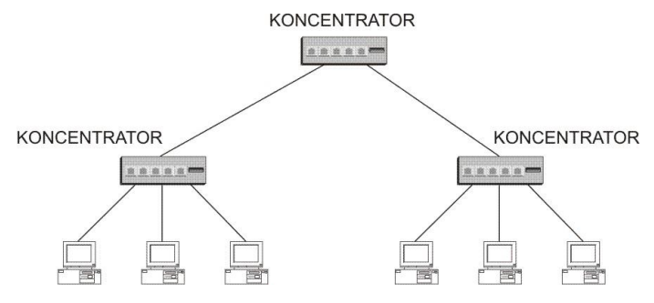

# Koncetrator (hub)

- jest wieloportowym [regeneratorem](regenerator.md)
- normalnie jest wykorzystywany do tworzenia połączeń między stacjami w topologii gwiazdy
- może służyć do kreowania wielopoziomowej hierarchii

## TODO - kolizje
