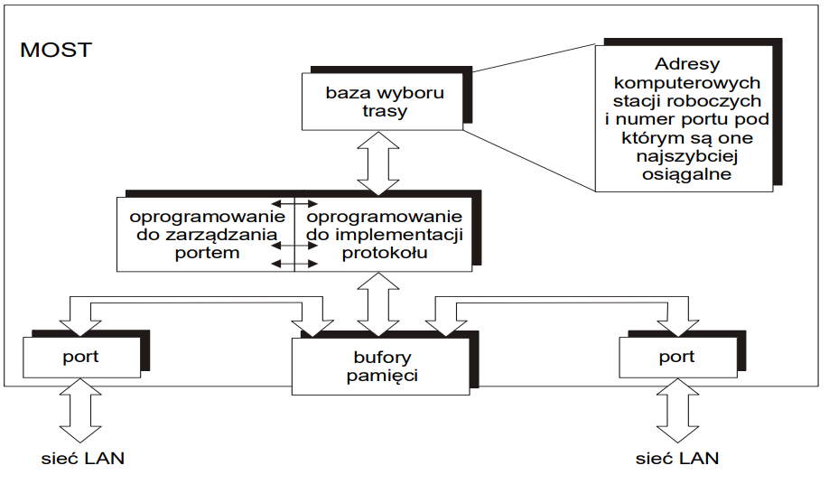

# Most

## Koncepcja pracy mostów

## Typy mostów

- mosty transparentne lub przezroczyste (ang.transparent bridges) - standard IEEE oznaczony symbolem 802.1d - CSMA/CD i Token Bus

  - Most przezroczysty prosty

    

    *Rys. Ruch lokalny między stacjami A i B przenoszony do drugiego segmentu sieci przez most transparentny prosty*
  - Most przezroczysty uczący się

    
    
    *Rys. Most znający położenie stacji w sieci*

  

- mosty ze sterowaniem źródłowym (ang. source-routing bridge) - w zasadzie użyte do łączenia wszystkich typów sieci lokalnych
- mosty łączone SRT (ang. source routing transparent), które pracują jako mosty przezroczyste dla ruchu "transparentnego" z sieci Ethernet lub Token Bus oraz jako mosty ze sterowaniem źródłowym dla ramek zawierających pole "Source Routing".

## W mostach występuje niebezpieczeństwo powstania

- sztormów
- multiplikacji
- pętli ramek

Lekarstwem na to jest [algorytm drzewa opinającego](../drzewo_opinajace/drzewo_opinajace.md)

## Porównanie mostów przezroczystych i źródłowych

- W sieciach wykorzystujących mosty przezroczyste, decyzje dotyczące wyboru trasy przesyłania ramek podejmowane są przez same mosty. Może to mieć istotny i niekorzystny wpływ na działanie sieci, w przypadku sieci bardzo dużych. Czas przetwarzania ramek może się wówczas niebezpiecznie wydłużyć.
- W sieciach wykorzystujących mosty ze źródłowym wyborem trasy, odpowiedzialność za wybór trasy spada na stacje końcowe, zwiększając tym samym ich obciążenie i wymuszając użycie procesorów o większej mocy obliczeniowej, co podraża ich koszt.
- Czas przetwarzania ramek w mostach przezroczystych jest większy niż w mostach ze źródłowym wyborem trasy, o czas wyboru dalszej trasy przesyłania ramek.
- Okresowa wymiana ramek typu BPDU w sieciach wykorzystujących mosty przezroczyste, pozwala na szybką reakcję mostówm w przypadku wystąpienia uszkodzeń w sieci.
- Realizacja [algorytmu drzewa opinającego](../drzewo_opinajace/drzewo_opinajace.md), powoduje blokadę niektórych portów, zmniejszając tym samym dostępną przepustowość dla segmentów sieci LAN.
- Ze względu na możliwość wystąpienia uszkodzeń w sieci, w sieciach wykorzystujących mosty ze źródłowym wyborem trasy, wymagana jest okresowa aktualizacja przechowywanych w stacjach źródłowych danych o routingu. Wiąże się to z koniecznością wysyłania co określony czas ramek rozgłoszeniowych, zwiększających obciążenie w sieci.
