# Przełączniki sieciowe

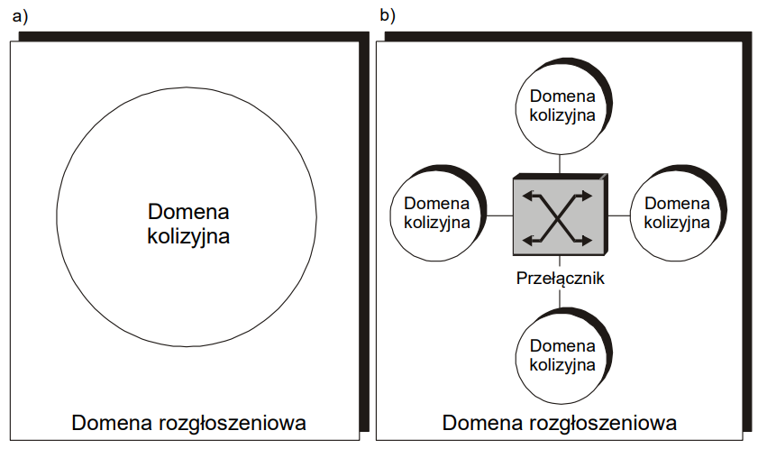

    Rys. Ilustracja podziału sieci LAN na domeny kolizyjne i rozgłoszeniowe

    a. przed instalacją przełącznika
    b. po instalacji przełącznika

## Różnica w działaniu Mostu i Przełącznika

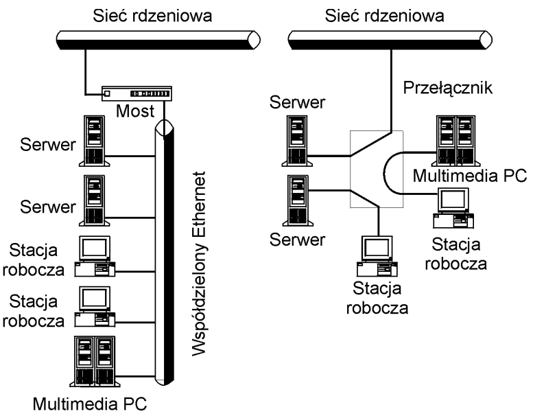

## Domena rozgłoszeniowa

W porównaniu do [routerów](../router/router.md), przełącznik nie rozdziela domen rozgłoszeniowych.

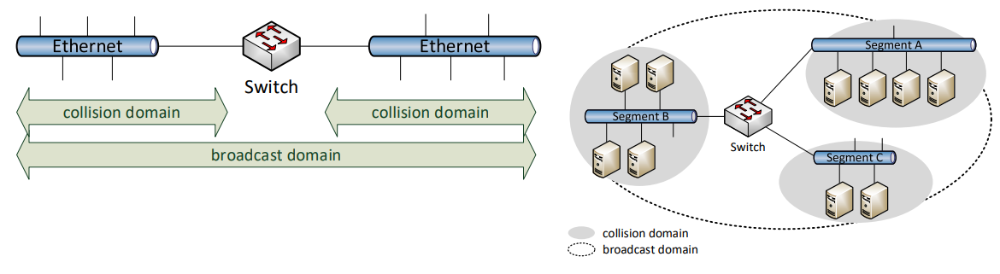

## Architektura przełącznika

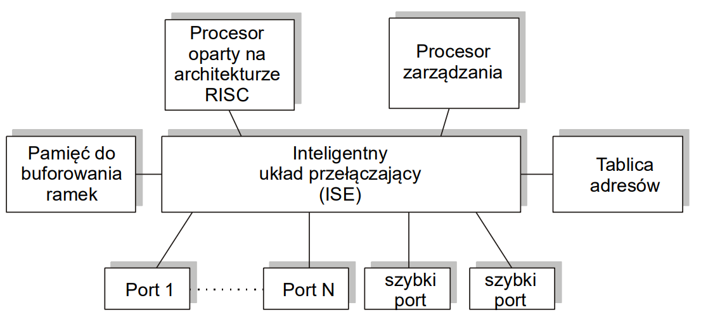

## Tryb pracy przełączników

- przełączania przezroczystego (ang. Transparent Bridging - TP)
- przełączania szybkiego bądź ekspresowego (ang. Express Switching - ES)

## Metody pracy przełaczników

- Cut-Through
- Store-and-Forward

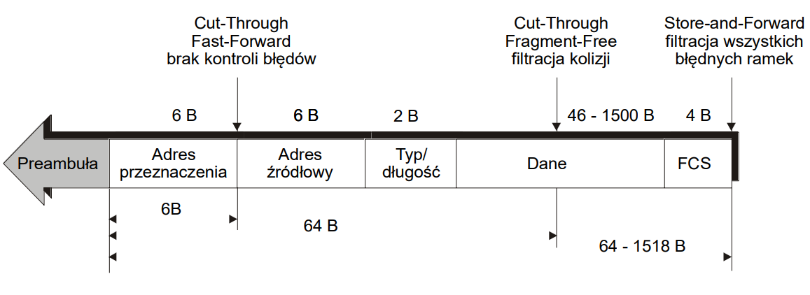

Przełączniki *cut through* należy stosować tam, gdzie zakeży nam głównie na szybkości, a ewentualne przekłamania nie "położą" nam aplikacji.

Te aplikacje, które nie tolerują błędów pojawiających się w danych, powinny być obsługiwane przez przełączniki w trybie "zapamiętaj i przekaż"

## W przełącznikach wykorzystywane są **trzy techniki buforowania**

- buforowanie wejściowe
- buforowanie wyjściowe - każdy port wyjściowy wyposażony jest w bufor. Pozwala to na unikanie powstawania zatorów, ponieważ wszystkie odbierane przez port wyjściowy ramki są umieszczane w buforze i dopiero stamtąd stopniowo przekazywane do sieci. Może dochodzić do zawłaszczania przez stację posiadającą dużo ramek do nadania - bufora portu wyjściowego (tzw. niesprawieliwość w dostępie). Rozwiązaniem tego problemu jest zastosowanie tylu buforów wyjściowych dla każdego portu wyjściowego ile jest portó wejściowych. Wymaga to rozbudowanego systemu pamięci
- buforowanie ścieżki (ang. path buffering) - każdy port wejściowy i wyjściowy wyposażone są w bufory. Rozwiązanie takie zwiększe opóznienia ramek, podnosi koszty implementacji oraz sprawia, że wykorzystanie pamięci przydzielonej na stałe do konkretnego portu jest mało efektywne.

## Typy przełączników (ze względu na wewnętrzną budowę i związany z tym algorytm pracy) oparte na

- budowie komutatora przestrzennego (ang. space-division)
- współdzielonym medium (ang. shared-medium)
- współdzielonej pamięci (ang. shared-memory)

### Architektura Krzyżowa

- jest prosta w realizacji
- działa na zasadzie komutatora przestrzennego stosowanego w przełącznikach telekomunikacyjnych
- **Wymaga zastosowania wielu buforów przechowujących dane**

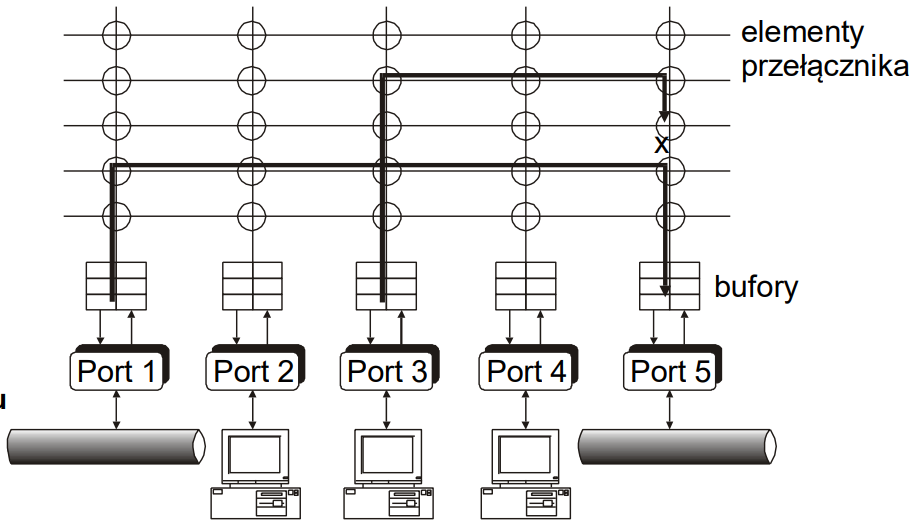
*Rys. Ilustracja blokowania bramek, spowodowanego brakiem buforów wyjściowych na porcie 5 w przełączniku o architekturze krzyżowej*

### Architektura ze współdzieloną pamięcią

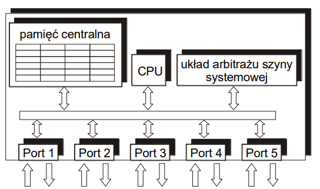
*Rys. Budowa przełącznika o współdzielonej pamięci o wspólnym dostępie*

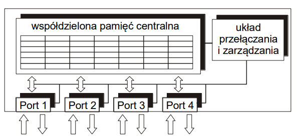
*Rys. Schemat budowy przełącznika o współdzielonej pamięci o równoległym dostępie*

## Kolejkowanie wyjściowe

### Jak szybko możemy dokonać podziału pamięci

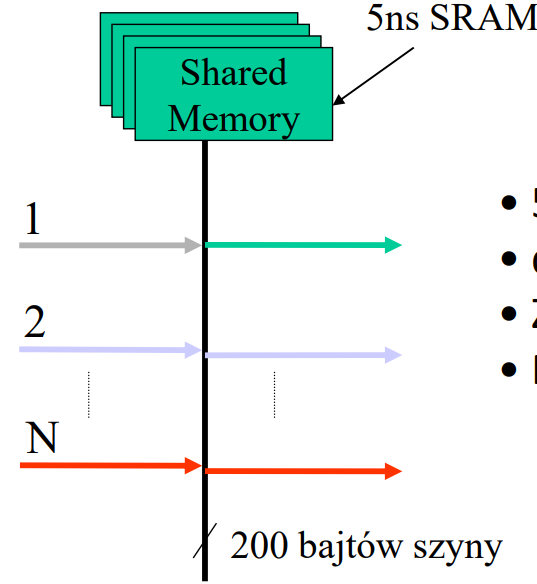

- 5ns na operacje pamięci
- dwie operacje pamięci na pakiet
- Zatem, teoretycznie 160 Gb/s
- Praktycznie osiągamy 80 Gb/s

## Sposoby wykorzystania przełączników

### Centralized backbone network

Core switch - element "krytyczny"
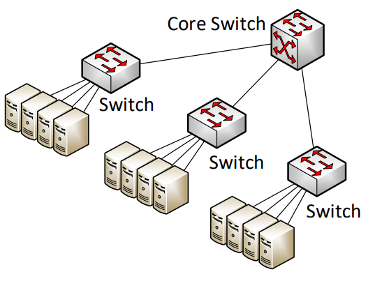

### Distributed backbone network

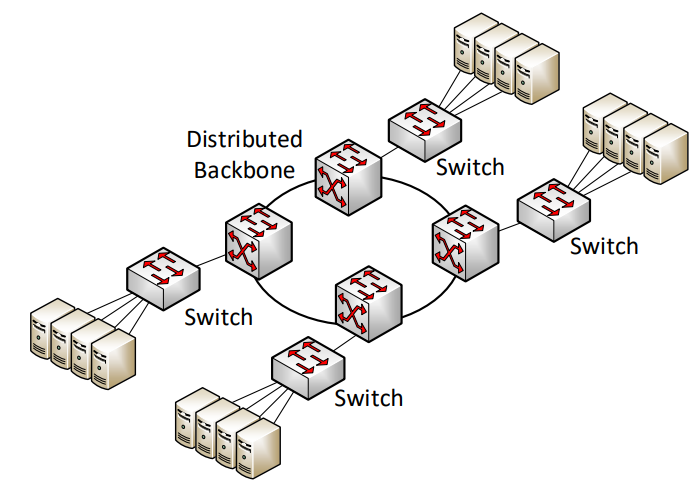

## Kryteria wyboru przełączników

1. "Standardowość" przełącznika - IEEE 802...(1d, p, Q, x; 3w ad)
2. Elastyczność - możliwość konfigurowania przełącznika na różne sposoby

    - autodedekcja 10/100/1000
    - wspieranie technologii 10/100/1000 ETH i innych (10/40/100 Gb/s ETH, ATM)
    - możliwość dublowania portów polegająca na tym, że wszystkie pakiety obsługiwane przez jeden port można kierować (kopiować) na inny port, co pozwala monitorować z zewnątrz pracę przełącznika
3. Przepustowość ("przędzy")
4. Pojemność tablic adresów MAC
5. Zarządzanie węzłem sieci - istotne jest, aby w warunkach maksymalnego obciążenia pakiety zarządzania (oparte np. na protokole SNMP) docierały zawsze do przełącznika
6. VLANy
7. "Szybkość przetwarzania ramek (np. 1 mln pakietów na sek. - jakich!?)
8. Zasięg - sketki 100m; powyżej 100 m związane jest z koniecznością przejścia na technologię światłowodową (np. 100Base-FX 400 m)
9. Możliwość kontrolowania przepływu pakietów (ETH)

    - automatyczne sterowanie ruchem pakietów rozgłoszeniowych
    - szereg opcji zmniejszających wolumen pakietów rozgłoszeniowych w obszarze warstyw sieciowej OSI (np. Organiczenie liczby pakietów rozgłoszeniowych i typu multicast w każdym porcie do poziomu np. 10% przepustowości portu)
    - stosunkowo prosta technika sztucznego blokowania medium (tzw. Jamming), dzięki której przełącznik w krytycznych dla niego sytuacjach nie jest bombardowany zbyt dużą liczbą pakietów
    - możliwość definiowania przez użytkowników progów (w odniesieniu do każdego z portów), których przełącznikowi nie wolno przekroczyć
    - ograniczenie liczby pakietów obsługiwanych przez dany port - poprzez zdefiniowanie listy adresów MAC, które dany port może obsługiwać (bezpieczeństwo)
