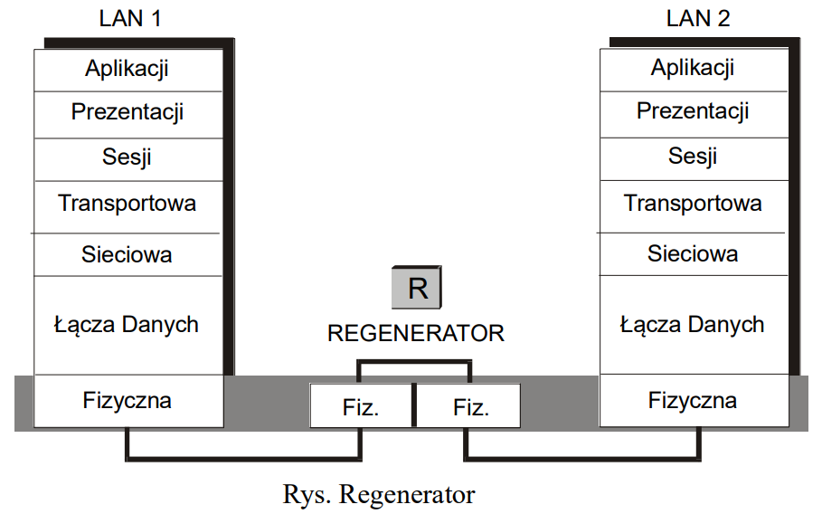
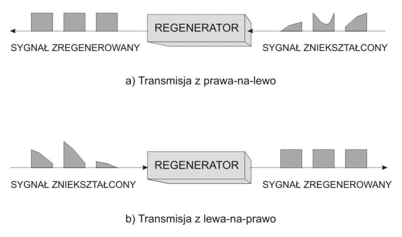

# Regenerator

## Funkcje regeneratorów

- Łączy segmenty sieci LAN
- Przekazuje każdą ramkę (bez możliwości filtrowania)
- Jest dwuportowym urządzeniem (pierwszej warstwy)
- Regeneruje sygnał

    

- pozwalają wydłużyć zasięg sieci (EE)
- zwiększają wielkość domeny kolizyjnej
- zwiększają wielkość domeny rozgłowszeniowej
