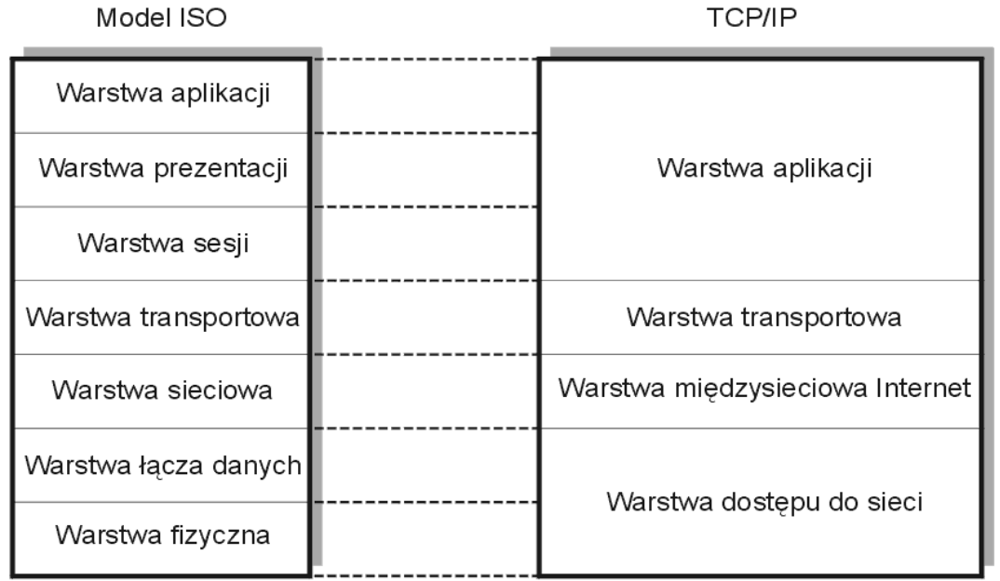

# TCP IP

zbiór protokółów sieciowych, które są odpowiedzialne za komunikację między urządzeniami ("hostami") dołączonymi do dowolnych niejednorodnych sieci komputerowych, takich jak sieci rozległe **WAN** (np. publiczne sieci pakietowe X.25, FR, IP, ...), sieci satelitarne, sieci pakietowe komunikacji ruchomej (radiowe - mobile packets radio networks), (szybkie) sieci lokalne **LAN**.

Powyższe sieci traktuje się jako jedną wspólnotę (Internet), a protokoły TCP/IP są nazywane protokołami Internetu.

Celem opracowania zbioru sieciowych protokołów TCP/IP było umożliwienie komunikacji pomiędzy systemami pochodzącymi od wielu różnych dostawców. Zmiany w architekturze TCP/IP są ściśle związane z rozwojem Internetu ( nternet Engineering Task Force IETF). Zasady działania Internetu ujmują dokumenty RFC. Protokoły Internetu są używane również w środowisku sieci lokalnych (np. TCP/IP w sieciach LAN typu Ethernet)

TCP/IP powstało wcześniej niż model odniesienia [ISO-OSI](../iso_osi/iso_osi.md), dlatego też warstwy nie są tak wyraźne i jednoznacznie zdefiniowane, a ich obecność (istnienie samej architektury warstwowej_ wynika bardziej z analizy funkcji realizowanych przez protkoły, niż z założeń projektantów sieci).

## Model warstwowy

Można przedstawić jedynie za pomocą czterech warstw

## Cechy wyróżniające usługi TCP/IP

### Niezależność od technologii

Protokoły TCP/IP definiują jednostkę danych (datagram) i określają reguły jego transmisji bez względu na technologię stosowaną w sieci.

### Zasięg światowy

Każdy komputer ma unikatowy adres. Każdy datagram ma w nagłówku parę adresów:

- komputera docelowego
- komputera źródłowego

Współpracować może dowolna para komputerów dołączonych do sieci (niezależnie od lokalizacji geograficznej).

### Potwierdzenia End-to-End

Potwierdzenia wymieniane są między komputerem docelowym i źródłowym.

### Zaimplementowane standardowe aplikacje

Protokoły TCP/IP zawierają standardy takie jak:

- poczta elektroniczna
- transfer zbiorów
- terminal wirtualny
- inne...
