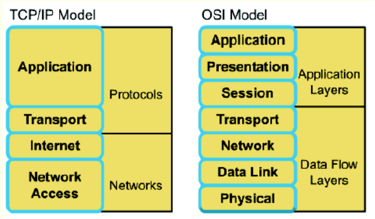
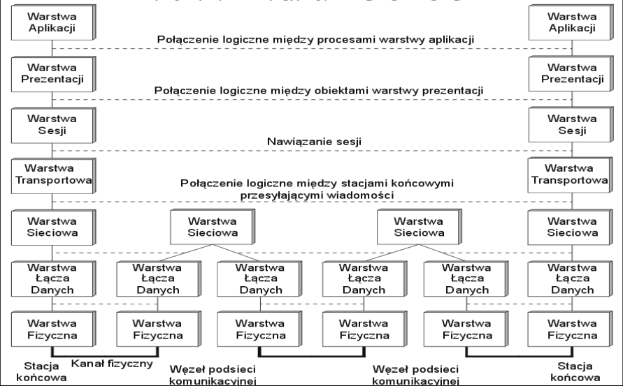
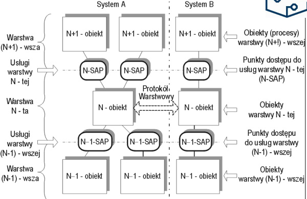

# Warstwowe architektury sieci

## Dlaczego systemy sieciowe projektuje się strukturalnie?

- Potrzeba zapewnienia wzajemnej współpracy różnorodnego sprzętu komputerowego
- Umożliwienie wymiany/modyfikacji poszczególnych modułów sprzętowych bądź programowych
- Ograniczenie złożoności sieci

## Co oznacza termin architektura warstwowa sieci?

- funkcje odpowiedzialne za realizację przekazu informacji pomiędzy urządzeniami końcowymi są oranizowane w postaci warstw
- całość oprogramowania sieciowego tworzy tzw. architekturę warstwową

## Modele warstwowe

### Ważniejsze architektury warswtowe

- ISO-OSI (ISO - Open System Interconnection)
- TCP/IP (Transmission Control Protocol/Internet Protocol)
- SNA (Systems Network Architecture) firmy IBM
- DNA (Digital Network Architecture) firmy DEC

### Główne róznice

- liczba warstw
- sposób ich realizacji
- zasady nawiązywania połączeń pomiędzy stacjami

## Współpraca między-warstwowa

### Zasady funkcjownowania mechanizmu warstwowego

- Zadanie warstwy N jest oferowanie usług transportowych warstwie wyższej tj. N+1
- Zbiór zasad i konwencji stosowanych przy wymianie informacji między procesami warstwy N-tej w komunikujących się stacjach (węzłach sieci) nazywamy umownie protokołem warstwy N-tej
- Obiekty tej samej warstwy, w różnych komputerach, realizują komunikację warstwową, nawiązując między sobą połączenie logiczne
